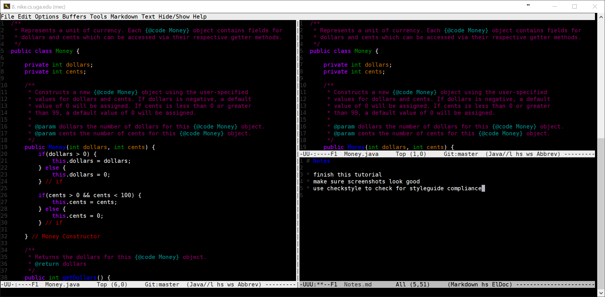

# Emacs Tutorial


## Table of Contents

## Control and Meta

Throughout this tutorial we will use `C` to refer to the control key (`CTRL`)
and `M` to refer to the meta key. On most systems, `ALT` or `ESC`
correspond to `M`. On macOS, the Terminal application can be configured
to use `OPT` as `M`.

| Key | Name    | Usually             |
|-----|---------|---------------------|
| `C` | Control | `CTRL`              |
| `M` | Meta    | `ESC`, `ALT`, `OPT` |

## Built-in Emacs Tutorial

**Learn by doing.** Emacs comes with a built-in, interactive turorial. It can be 
reached by launching Emacs using the `emacs` command, then typing `C-h t`. 
That is, type `C-h`, then type `t`.

## Open / Create File

To **open a file** called `src/cs1302/Test.java` in Emacs, you can execute the
following command:

```
$ emacs src/cs1302/Test.java
```

Alternatively, you can simply execute `emacs`, then use `C-x C-f` to find the
file you're trying to open.

To **create a file**, use one of the methods just desribed with your desired
filename. When you create a new file, Emacs will display `(New file)` at 
the bottom of the screen. The new file does not actually exist until you
save it, usually using `C-x C-s`.

## Basic Commands

### Open, Save, and Exit

| Binding   | Action                                                                 |
|-----------|------------------------------------------------------------------------|
| `C-x C-c` | Close/Exit Emacs                                                       |
| `C-x C-f` | Open/Find file                                                         |
| `C-x C-s` | Save current window / buffer                                           |

### Cancel

To cancel a partially typed command (e.g., when you mistype), use `C-g`. 

| Binding   | Action                                                                 |
|-----------|------------------------------------------------------------------------|
| `C-g`     | Quit/cancel a partially typed command                                  |

### Navigation

In Emacs, there are special key bindings for navigation that can (and should) be
used instead of the standard arrow keys so that your hands rarely have a need to
leave the main part of the keyboard. The more time you spend in the main area of
the keyboard, the more productive you can be when programming. 

| Binding   | Action                                                                 |
|-----------|------------------------------------------------------------------------|
| `C-b`     | Move back/left one character                                           |
| `M-b`     | Move back/left one word                                                |
| `C-f`     | Move forward one character                                             |
| `M-f`     | Move forward one word                                                  |
| `C-p`     | Move to previous line                                                  |
| `C-n`     | Move to next line                                                      |
| `C-v`     | Move down one page                                                     |
| `C-a`     | Move to the beginning of the current line                              |
| `C-e`     | Move to the end of the current line                                    |
| `M-v`     | Move up one page                                                       |
| `C-l`     | Scroll to make the current line appear in the center, bottom, then top |

### Delete

In Emacs, you can forward and backward delete single characters and forward 
delete words.

| Binding   | Action                                                                 |
|-----------|------------------------------------------------------------------------|
| `C-h`     | Backward delete a single character (similar to the backspace key)      |
| `C-d`     | Forward delete a single character (similar to the delete key)          |
| `M-d`     | Forward delete a word                                                  |

### Undo

If you want to undo some recent changes, then use `C-_` where `_` is the underscore.
On most system, this means holding the `CTRL`, `SHIFT`, and `-` keys at the same 
time. Using `C-_` one undoes one batch of changes. If you hold it down, then it
will keep undoing.

| Binding   | Action                                                                 |
|-----------|------------------------------------------------------------------------|
| `C-x u`   | Undo one batch of changes--usually, one character worth                |
| `C-_`     | Undo one batch of changes--usually, one command worth                  |

### Selections and Copy / Paste

In Emacs, the term _kill buffer_ refers to clipboard memory.

| Binding   | Action                                                                 |
|-----------|------------------------------------------------------------------------|
| `C-<SPC>` | Set the mark point (i.e., start a selection)                           |
| `C-k`     | Kill / Cut the current line (goes into kill buffer)                    |
| `C-w`     | Cut selection (goes into kill buffer)                                  |
| `M-w`     | Copy selection (goes into kill buffer)                                 |
| `C-y`     | Paste / Yank (from kill buffer)                                        |

Use `C-<SPC>` to start your selection, then navigate to where you want the selection
to end. Once your text is selected, use one of the other key bindings to cut or copy
the selection into the kill buffer. To paste, navigate to where you want to paste, 
then yank the text from the kill buffer. 

### Splitting the Screen

Emacs makes it easy to split your screen, enabling you to move, copy, paste, etc.
between multiple files with ease. 



In Emacs, each window is called a buffer. When we talk about splitting, we talk
about splitting the _current buffer_. When multiple buffers are displayed,
Emacs places the text cursor in the current buffer and usually highlights
the area containing the buffer's name.

| Binding   | Action                                                                 |
|-----------|------------------------------------------------------------------------|
| `C-x 1`   | Maximize current buffer                                                |
| `C-x 2`   | Split buffer horizontally (i.e., one stacked on top the other)         |
| `C-x 3`   | Split buffer vertically (i.e., side-by-side)                           |
| `C-x o`   | Navigate to an(o)ther buffer                                           |
| `C-x C-b` | List available buffers                                                 |

To open a file in another buffer, navigate to that buffer then use `C-x C-f` to
find and open your desired file. If you previously openned the file, then it's
likely still available. In that case, use `C-x C-b` to list the available buffers,
navigate to the text for the file's name, then type `RET` to replace the current
buffer area with the desired buffer.  

<hr/>

[](http://creativecommons.org/licenses/by-nc-nd/4.0/)

<small>
Copyright &copy; Michael E. Cotterell, Bradley J. Barnes, and the University of Georgia.
This work is licensed under a <a rel="license" href="http://creativecommons.org/licenses/by-nc-nd/4.0/">Creative Commons Attribution-NonCommercial-NoDerivatives 4.0 International License</a> to students and the public.
The content and opinions expressed on this Web page do not necessarily reflect the views of nor are they endorsed by the University of Georgia or the University System of Georgia.
</small>
