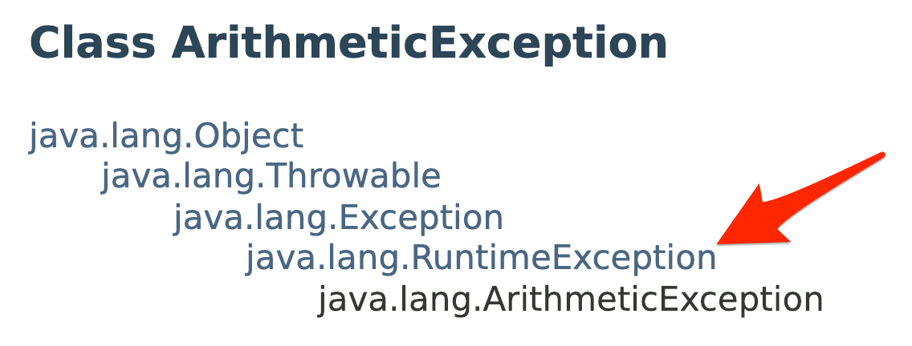

# Checked vs. Unchecked Exceptions

In Java, exceptions are either _checked_ or _unchecked_. Checked exceptions must be explicitly caught or propagated by the programmer, whereas 
unchecked exception may or may not be handled by the programmer.  Let's look at an example.

1. On Nike, create the class `exceptions.Unchecked` containing the following code:

   ```java
   package exceptions;

   public class Unchecked {
       public static void main(String [] args) {
          int result = 4/0;
          System.out.println(result);
       } // main
   } // Test
   ```

1. Compile and run `exceptions.Test`. You should get the following error message:

   ```
   Exception in thread "main" java.lang.ArithmeticException: / by zero
      at exceptions.Test.main(Test.java:5)
   ```
   An [`ArithmeticException`](https://docs.oracle.com/javase/8/docs/api/java/lang/ArithmeticException.html)
   (divide by zero) caused our program to crash. Since `ArithmeticException` is an **unchecked exception**, the
   Java compiler did not force us (the programmer) to catch or throw this exception.  It is completely up to the programmer to decide 
   whether or not to handle exceptions of this type. You've probably experienced other, unchecked exceptions such as:
   [`StringIndexOutOfBoundsException`](https://docs.oracle.com/javase/8/docs/api/java/lang/StringIndexOutOfBoundsException.html), 
   [`NullPointerException`](https://docs.oracle.com/javase/8/docs/api/java/lang/NullPointerException.html),
   [`NumberFormatException`](https://docs.oracle.com/javase/8/docs/api/java/lang/NumberFormatException.html), etc.

1. One nike, create the class `exceptions.Checked` containing the following code:

   ```java
   package exceptions;

   import java.util.Scanner;
   import java.io.File;

   public class Checked {
       public static void main (String[] args) {
           File notesFile = new File("notes.txt");
           Scanner input = new Scanner(notesFile);
           System.out.println(input.nextLine());
       } // main
   } // Checked
   ```

   In this program, we are reading the first line of the file `notes.txt`. The first line of the `main` method creates a `File` object 
   called `notesFile`.  Then, it passes this object to the `Scanner` constructor.  As you may have guessed, the `input` object will read
   its input from the file (instead of the keyboard).  We will create the `notes.txt` file in a bit.

1. Compile `Checked.java`.  You should get an error similar to the following:

   ```
   src/exceptions/Checked.java:9: error: unreported exception FileNotFoundException; must be caught or declared to be thrown
      Scanner input = new Scanner(notesFile);
                      ^
   ```
   This error indicates that the `Scanner` constructor throws a `FileNotFoundException`.  This is a **checked exception**.  The programmer
   must either surround this line of code with a try-catch or add a throws clause to the main method to propogate this exception if it
   occurs.  However, we never want to add a throws clause to the main method.
   
1. Modify `Checked.java` to include an appropriate try-catch:

   ```java
   import java.util.Scanner;
   import java.io.File;
   import java.io.FileNotFoundException;

   public class Checked {
       public static void main (String[] args) {
           File notesFile = new File("notes.txt");
           Scanner input = null;
           try {
               input = new Scanner(notesFile);
           } catch(FileNotFoundException e) {
               System.out.println(e.getMessage());
           }
           System.out.println(input.nextLine());
       } // main
   } // Checked
   ```

1. Create a `notes.txt` file in the same directory that you execute the `java` command to run the program. Write a single line in that
file.

1. Execute `Checked.java`.  It should print the first line of `notes.txt`.

## How to tell if an exception is checked or unchecked

For now, we will use a simple method for checking if an exception is checked or unchecked.

1. Visit the java API page for [`ArithmeticException`](https://docs.oracle.com/javase/8/docs/api/java/lang/ArithmeticException.html)

1. Notice 

   
<hr/>

[](http://creativecommons.org/licenses/by-nc-nd/4.0/)

<small>
Copyright &copy; Michael E. Cotterell, Brad Barnes, and the University of Georgia.
This work is licensed under a <a rel="license" href="http://creativecommons.org/licenses/by-nc-nd/4.0/">Creative Commons Attribution-NonCommercial-NoDerivatives 4.0 International License</a> to students and the public.
The content and opinions expressed on this Web page do not necessarily reflect the views of nor are they endorsed by the University of Georgia or the University System of Georgia.
</small>
